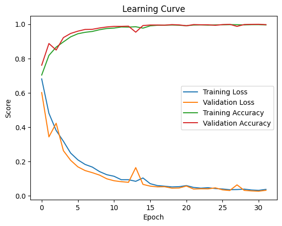

# Sentiment Analysis Model for Accurate Movie Reviews

This project aims to build a sentiment analysis model that can accurately predict the sentiment of movie reviews. The motivation behind this project is to help movie companies get a better understanding of how people feel about movies, beyond just their rating scores on sites like IMDb or Rotten Tomatoes.

In the preprocessing step, we applied lemmatization and padding to the input data. Lemmatization is a process of reducing words to their base or root form, which helps in reducing the dimensionality of the input space and improving the accuracy of the model. We used the SnowballStemmer from the NLTK library to perform lemmatization. Additionally, we also removed stop words and non-valid words from the input data. Finally, we transformed the preprocessed data into word embeddings using pre-trained GloVe embeddings. The maximum number of words was set to 20000, and the maximum length of a sequence was set to 500.

The model is built using a Long Short-Term Memory (LSTM) neural network with bidirectional layers and dropout regularization. The input data is preprocessed using lemmatization and padding, and then transformed into word embeddings using pre-trained GloVe embeddings. The model is trained using binary cross-entropy loss and optimized with the Adam optimizer.

## Model Architecture

The model consists of the following layers:

1. **Embedding layer**: This layer maps each word in the input sequence to its corresponding word embedding vector. The embedding matrix is initialized with pre-trained GloVe embeddings and is trainable during training.
2. **Bidirectional LSTM layer**: This layer processes the input sequence in both forward and backward directions, allowing the model to capture long-term dependencies and context information.
3. **Dropout layer**: This layer randomly drops out some of the neurons in the previous layer during training, preventing overfitting and improving generalization.
4. **Dense layer**: This layer applies a linear transformation to the output of the previous layer and applies the ReLU activation function.
5. **Dropout Layer**: This layer randomly drops out some of the neurons in the previous layer during training to prevent overfitting.
6. **Dense Layer**: This layer applies a linear transformation to the output of the previous layer and applies the ReLU activation function.
7. **Output Layer**: This layer applies the sigmoid activation function to the output of the previous layer, producing a probability value between 0 and 1 that represents the predicted sentiment score.

## Model Training and Evaluation

We trained the model using the best parameters obtained from a RandomizedSearchCV. The model achieved a test accuracy of 99.83% and a test AUC score of 0.9999, indicating that it can accurately predict the sentiment of movie reviews. By using this model, movie companies can get a more nuanced understanding of how people feel about movies, based on the actual text of their reviews rather than just their rating scores.

## Streamlit App

The Streamlit app allows you to enter a movie title, and it will scrape fresh reviews from IMDb and Metacritic to find the scores for the movie, the top positive and negative review, and a word cloud for each the positive and negative reviews.

## Conclusion

In this project, we successfully built a sentiment analysis model that can accurately predict the sentiment of movie reviews. The model achieved a test accuracy of 99.83% and a test AUC score of 0.9999, demonstrating its ability to classify movie reviews as positive or negative effectively. The Streamlit app provides a convenient way to explore movie reviews and visualize the sentiment analysis results, enhancing the understanding of how people feel about movies beyond just their rating scores.
